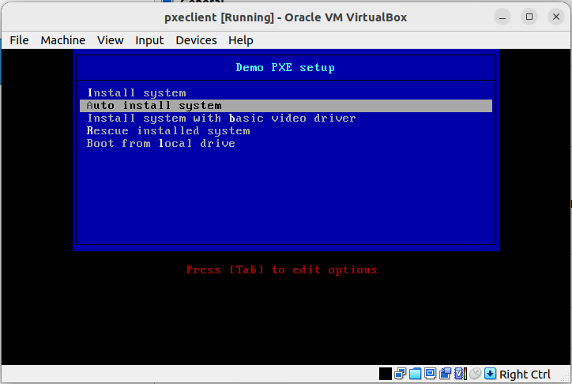
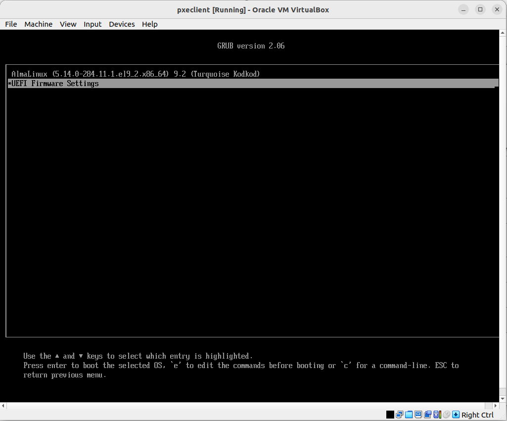
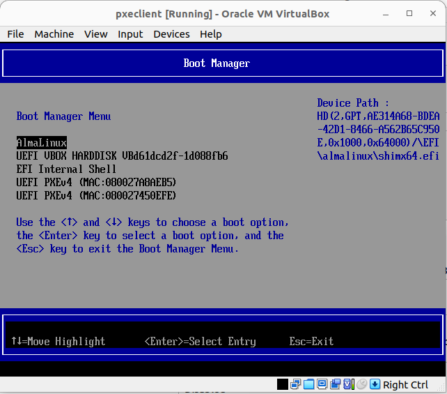
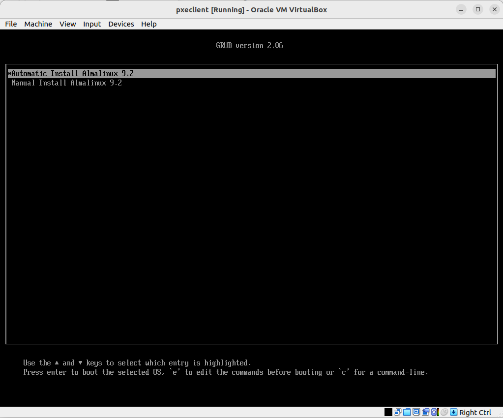

# DHCP, PXE 
Для выполнения этого действия требуется установить приложением git:
`git clone https://github.com/altyn-kenzhebaev/dhcp_pxe-hw19.git`
В текущей директории появится папка с именем репозитория. В данном случае dhcp_pxe-hw19. Ознакомимся с содержимым:
```
cd dhcp_pxe-hw19
ls -l
README.md
ansible
Vagrantfile
bios.png
UEFI1.png
UEFI2.png
UEFI3.png
```
Здесь:
- ansible - папка с плэйбуком
- README.md - файл с данным руководством
- bios.png, UEFI1.png, UEFI2.png, UEFI3.png - картинки прикрепленные к данному руководству
- Vagrantfile - файл описывающий виртуальную инфраструктуру для `Vagrant`
Для начало необходимо скачать актуальный образ системы, возьмём для примера дистрибьютив ОС Almalinux 9.2
На локальной машине переходим папку Downloads, и качаем образ, для меня ближайший репозиторий в Казахстане:
```
cd ~\Downloads
wget http://mirror.ps.kz/almalinux/9.2/isos/x86_64/AlmaLinux-9-latest-x86_64-minimal.iso
```
Запускаем тестовй стенд:
```
vagrant up pxeserver
```
## Особенности развертывания pseserver (Выжимка ansible)
Первым делом, ставятся пакеты:
```
#Установка репозитория EPEL
  - name: install EPEL
    yum:
      name:
        - epel-release
      state: present
      update_cache: true

#Установка нужных пакетов
  - name: install softs on linux
    yum:
      name:
        - epel-release
        - tftp-server
        - dhcp-server
        - nfs-utils
        - syslinux-tftpboot
        - yum-utils
        - tftp
      state: present
      update_cache: true
```
Поставил пакет tftp для нахождения неисправностей tftp-server, к примеру можно обратиться к серверу и скачать файл `tftp  "10.0.0.20"  -c get "uefi/shim.efi"` 

---
Дальше нужно смонтировать скачанный образ в pxeserver, можно это сделать вручную через графический интерфейс, можно указать в Vagrantfile:
```
      server.vm.provider "virtualbox" do |vb|
        vb.name = 'pxeserver'
        vb.memory = "1024"
        vb.customize ["modifyvm", :id, "--natdnshostresolver1", "on"]
        vb.customize ["storageattach", :id, "--storagectl", "SATA Controller", "--port", 2, "--device", 0, "--type", "dvddrive", "--medium", home + '/Downloads/AlmaLinux-9-latest-x86_64-minimal.iso']
        vb.customize [
            'modifyvm', :id,
            '--firmware', 'bios',
            '--boot1', 'disk',
            '--boot2', 'none',
            '--boot3', 'none',
            '--boot4', 'none'
          ]
      end
```
Далее в ansible тривильная постановка taskа mount и настройка nfs-server:
```
#Монтирование ISO как шаринг nfs
  - name: Create ISO directory
    file:
      path: /mnt/almalinux9-install
      state: directory
      mode: '0755'

#Монтируем образ в каталог /mnt
  - name: Mount ISO image
    mount:
      path: /mnt/almalinux9-install
      src: /dev/sr0 
      fstype: iso9660
      opts: ro,loop
      state: mounted

#Создаем share в nfs
  - name: share in /etc/exports file
    ansible.builtin.lineinfile:
      path: /etc/exports
      state: present
      line: '/mnt/almalinux9-install *(ro)'
    notify: restart NFS server
```
---
Дальше настраиваем tftp-server, создаем пользователя tftp в целях запуска процесса под этим пользователем, конфигурируем tftp.service:
```
  #Создаем пользователя tftp
  - name: Add the user 'tftp'
    ansible.builtin.user:
      name: tftp
      shell: /sbin/nologin

  # tftp.service
[Unit]
Description=Tftp Server
Requires=tftp.socket
Documentation=man:in.tftpd

[Service]
ExecStart=/usr/sbin/in.tftpd -s /var/lib/tftpboot -u tftp -p
StandardInput=socket

[Install]
Also=tftp.socket
```
Здесь нужно учесть что все файлы и папки создаются и копируются с владельцем и группой tftp. Также для запуска виртуальных машин с включенными UEFI нужно включить ополнительные файлы:
```
#Создаём каталог /var/lib/tftpboot/uefi
  - name: Create TFTP directory UEFI
    file:
      path: /var/lib/tftpboot/uefi
      state: directory
      owner: tftp
      group: tftp
      mode: '0750'

#Копируем конфиг grub.cfg
  - name: set up pxelinux
    copy:
      src: grub.cfg
      dest: /var/lib/tftpboot/uefi/grub.cfg
      owner: tftp
      group: tftp
      mode: '0640'

#Копируем файлы в каталог /var/lib/tftpboot/uefi/
  - name: copy initrd and vmlinuz files to TFTP share
    copy:
      src: /mnt/almalinux9-install/EFI/BOOT/grubx64.efi
      dest: /var/lib/tftpboot/uefi/grubx64.efi
      mode: '0550'
      owner: tftp
      group: tftp
      remote_src: true

#Копируем файлы в каталог /var/lib/tftpboot/uefi/
  - name: copy initrd and vmlinuz files to TFTP share
    copy:
      src: /boot/efi/EFI/almalinux/shim.efi
      dest: /var/lib/tftpboot/uefi/shim.efi
      mode: '0550'
      owner: tftp
      group: tftp
      remote_src: true
# grub.cfg
set default=0
set timeout=60
insmod efinet
menuentry  'Automatic Install Almalinux 9.2' --class fedora --class gnu-linux --class gnu --class os {
   linuxefi pxelinux/images/Almalinux-9/vmlinuz ip=dhcp inst.ks=nfs:10.0.0.20:/home/vagrant/cfg/ks.cfg inst.repo=nfs:10.0.0.20:/mnt/almalinux9-install 
   initrdefi pxelinux/images/Almalinux-9/initrd.img
}
menuentry  'Manual Install Almalinux 9.2' --class fedora --class gnu-linux --class gnu --class os {
   linuxefi pxelinux/images/Almalinux-9/vmlinuz ip=dhcp inst.repo=nfs:10.0.0.20:/mnt/almalinux9-install
   initrdefi pxelinux/images/Almalinux-9/initrd.img
}
```
---
Далее настройка dhcp-server:
```
#Копирование файла конфигурации DHCP-сервера
  - name: set up dhcp-server
    copy:
      src: dhcpd.conf
      dest: /etc/dhcp/dhcpd.conf
      owner: root
      group: root
      mode: '0644'
    notify: restart dhcp-server
# dhcpd.conf
option space pxelinux;
option pxelinux.magic code 208 = string;
option pxelinux.configfile code 209 = text;
option pxelinux.pathprefix code 210 = text;
option pxelinux.reboottime code 211 = unsigned integer 32;
option architecture-type code 93 = unsigned integer 16;

subnet 10.0.0.0 netmask 255.255.255.0 {
        option subnet-mask 255.255.255.0;
        option broadcast-address 10.0.0.255;
        option routers 10.0.0.20;
        option domain-name-servers 10.0.2.15;
        range 10.0.0.100 10.0.0.120;

        class "pxeclients" {
          match if substring (option vendor-class-identifier, 0, 9) = "PXEClient";
          next-server 10.0.0.20;

          if option architecture-type = 00:07 {
            filename "uefi/shim.efi";
            } else {
            filename "pxelinux/pxelinux.0";
          }
        }
}
```
---
Далее настройка шаринга файла Kickstart, файл конфигурации отредактирована, установлен часовой пояс Asia/Bishkek и добавлен пользователь vagrant
```
#Создаём каталог /home/vagrant/cfg
  - name: Create CFG directory for Kickstart
    file:
      path: /home/vagrant/cfg
      state: directory
      owner: vagrant
      group: vagrant

#Копируем ks.cfg для Kickstart
  - name: set up Kickstart
    copy:
      src: ks.cfg
      dest: /home/vagrant/cfg/ks.cfg
      owner: vagrant
      group: vagrant

#Создаем share в nfs для Kickstart
  - name: share in /etc/exports file
    ansible.builtin.lineinfile:
      path: /etc/exports
      state: present
      line: '/home/vagrant/cfg *(ro)'
    notify: restart NFS server
```
## Запуск pxeclient
```
vagrant up pxeclient
```
### Через BIOS
Запускается Vagranfile с включением следующих опций:
```
          vb.customize [
              'modifyvm', :id,
              '--firmware', 'bios',
              '--graphicscontroller', 'vmsvga',
              '--nic1', 'intnet',
              '--intnet1', 'pxenet',
              '--nic2', 'nat',
              '--boot1', 'net',
              '--boot2', 'none',
              '--boot3', 'none',
              '--boot4', 'none'
            ]
```

### Через EFI (special OSes only)
Для этого требуется закомментировать `'--firmware', 'bios',` в Vagranfile, по-умолчанию данный образ загружается с UEFI.
ВНИМАНИЕ: тут необходимо во время загрузки нажать кнопку `Esc`, чтобы попасть в окошко загрузки UEFI, далее переходим UEFI Firmware Settings => Boot Manager => UEFI PXEv4 (мак адрес сети pxenet)


